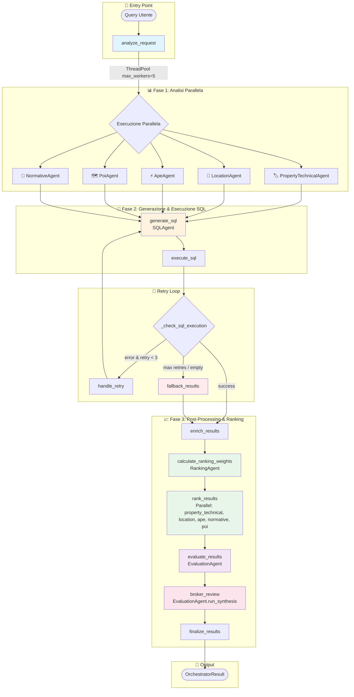
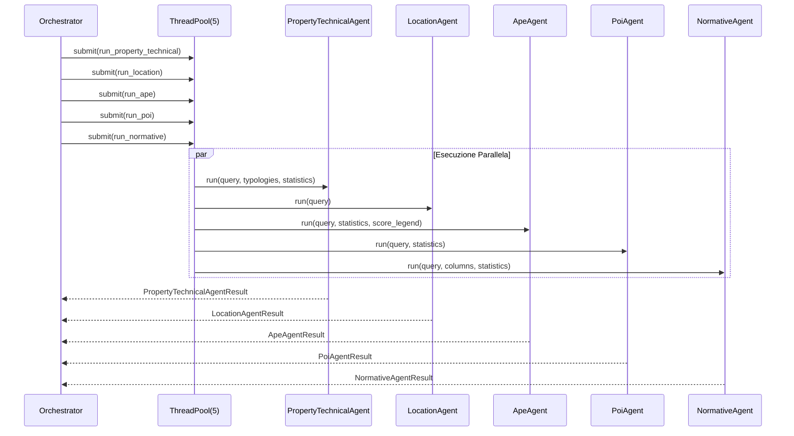
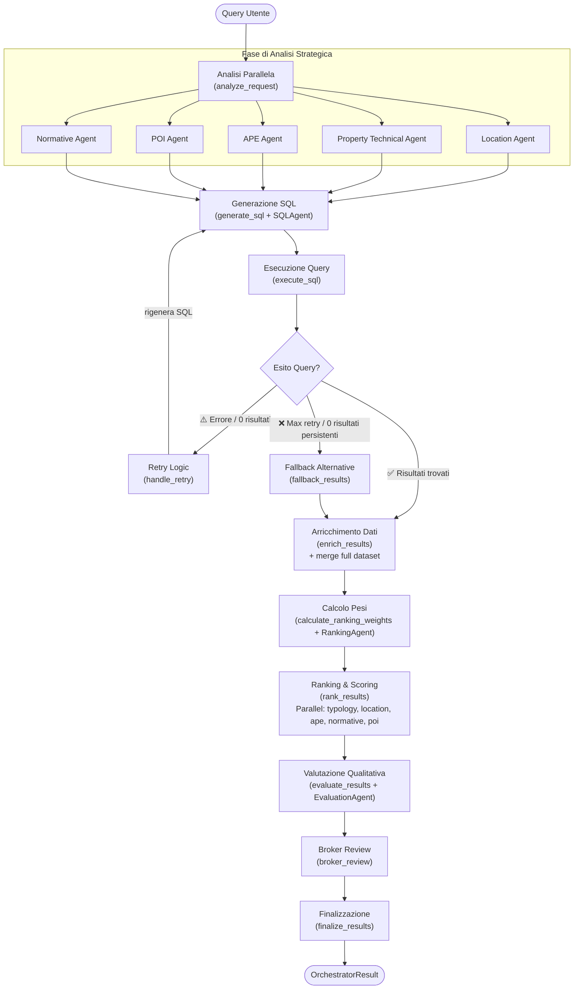

# 🗺️ Architettura Sistema Multi-Agente

> **Documento Aggiornato**: 6 Febbraio 2026  
> **Autore**: Senior AI Architect  
> **Scope**: Architettura attuale del sistema `backend/app/services/llm/agents/`

---

## 📋 Executive Summary

Il sistema implementa una **pipeline multi-agente orchestrata tramite LangGraph** per l'analisi e valorizzazione di immobili pubblici del MEF (Ministero dell'Economia e delle Finanze). L'architettura si basa su un pattern **StateGraph** con nodi specializzati che eseguono task paralleli dove possibile.

**Componenti Principali:**
- **1 Orchestratore** (GraphOrchestratorAgent) basato su LangGraph
- **8 Agenti Specializzati** con responsabilità distinte
- **Pattern di Retry** per la correzione di errori SQL
- **Fallback robusto** per garantire sempre risultati

---

## 1. 🔄 Mappa del Sistema (Mermaid)

### 1.1 Grafo Principale di Esecuzione



### 1.2 Dettaglio Chiamate Parallele (ThreadPoolExecutor)



stateDiagram-v2
    [*] --> execute_sql
    execute_sql --> check_result
    
    check_result --> enrich_results: success (rows > 0)
    check_result --> handle_retry: error AND retry < 3
    check_result --> fallback_results: (empty) OR (retry >= 3)
    
    handle_retry --> generate_sql: retry_count++
    
    fallback_results --> enrich_results: load top 500 from dataset
    
    enrich_results --> [*]
```

### 1.4 Diagramma di Flusso (Semplificato)

> Obiettivo: una vista “da decision-maker” del comportamento dell’orchestratore, enfatizzando: **analisi parallela**, **generazione+esecuzione SQL**, **retry**, **ranking/eval**, **fallback**.



### 1.5 Albero Decisionale dell’Orchestratore (Tree)

> Questa vista enfatizza **le decisioni** e i **rami** (successo / retry / fallback) più che la sequenza completa.

```mermaid
graph TD
  Q([Query Utente]) --> AR[analyze_request]

  %% --- Parallel fan-out (analisi iniziale) ---
  AR --> P{{Analisi in parallelo}}
  P --> T[PropertyTechnicalAgent]
  P --> L[LocationAgent]
  P --> A[ApeAgent]
  P --> N[NormativeAgent]
  P --> PO[PoiAgent]

  %% --- Join verso SQL ---
  L & T & A & N & PO --> GS[generate_sql (SQLAgent)]
  GS --> ES[execute_sql]

  %% --- Decision node ---
  ES --> D{_check_sql_execution}

  %% --- Success path ---
  D -->|continue: risultati > 0| ENR[enrich_results]
  ENR --> CW[calculate_ranking_weights\n(RankingAgent)]
  CW --> RK[rank_results\nParallel: typology, location, ape, normative, poi]
  RK --> EV[evaluate_results]
  EV --> BR[broker_review]
  BR --> FIN[finalize_results]
  FIN --> OUT([OrchestratorResult])

  %% --- Retry paths (loop) ---
  D -->|retry: execution_error & retry_count < 3| HR1[handle_retry]
  HR1 --> GS

  %% --- Fallback path ---
  D -->|fallback: (0 risultati) OR (max retry)| FB[fallback_results\n(top 500 alternative)]
  FB --> ENR

  %% --- Styling ---
  classDef node fill:#151515,stroke:#6b7280,color:#ffffff;
  classDef decision fill:#111827,stroke:#fbbf24,color:#ffffff;
  classDef warn fill:#111827,stroke:#f87171,color:#ffffff;

  class Q,AR,P,L,T,A,N,PO,GS,ES,ENR,CW,RK,EV,BR,FIN,OUT node;
  class D decision;
  class FB warn;
```

---

## 2. 📦 Dettaglio Agenti & Interfacce

### 🤖 GraphOrchestratorAgent (Orchestratore Principale)

**Scopo:** Coordina l'intera pipeline multi-agente usando LangGraph StateGraph.

**Input State (GraphState):**
```json
{
  "query": "Sto valutando un investimento immobiliare a Torino...",
  "dataset_key": "full",
  "base_dataset": "<pd.DataFrame>",
  "dataset_path": "/path/to/dataset.parquet",
  "db_schema": {"IMMOBILI": {"columns": [...]}},
  "db_metadata": {"tipologia_bene_immobile": {"values": ["Abitazione", ...]}},
  "dataset_metadata": {"columns": ["id", "indirizzo", ...], "typologies": [...]},
  "llm_limit": 10,
  "map_limit": 500,
  "metro_graph": "<NetworkX Graph>"
}
```

**Output Schema (OrchestratorResult):**
```json
{
  "map_df": "<pd.DataFrame con tutti i risultati rankati>",
  "location": [["Torino Centro", 45.0677, 7.6825]],
  "status_msg": "Trovati 42 immobili corrispondenti.",
  "gemini_responses": {
    "property_technical_extraction": {...},
    "location_extraction": {...},
    "sql_generation": {...},
    "evaluation": {...},
    "broker_review": "..."
  },
  "where_clause": "WHERE tipologia = 'Abitazione' AND ...",
  "context": "<AgentContext>",
  "broker_summary": "Executive summary comparativo..."
}
```

---

### 🏷️ PropertyTechnicalAgent

**Scopo:** Analizza la richiesta utente per identificare le caratteristiche planimetriche, tecniche, catastali e tipologiche degli immobili.

**Input State:**
```json
{
  "query": "Cerco una scuola in centro",
  "available_typologies": "['Abitazione', 'Edificio scolastico', 'Ufficio strutturato', ...]"
}
```

**Output Schema (PropertyTechnicalAgentResult):**
```json
{
  "raw_text": "{\"typologies\":[\"Edificio scolastico (es.: scuola...)\"]}",
  "typologies": [
    "Edificio scolastico (es.: scuola di ogni ordine e grado, università, scuola di formazione)"
  ],
  "prompt": {
    "system": "Sei l'esperto delle caratteristiche planimetriche...",
    "user": "Lista delle tipologie disponibili: [...] Richiesta utente: \"...\"",
    "full_text": "[SYSTEM]...[USER]..."
  }
}
```

**Modello LLM:** Configurabile via `settings.agent_models["property_technical_agent"]`

---

### 📍 LocationAgent

**Scopo:** Estrae riferimenti geografici (città, zone, POI, indirizzi) dalla query.

**Input State:**
```json
{
  "query": "Trilocale vicino al Politecnico di Torino"
}
```

**Output Schema (LocationAgentResult):**
```json
{
  "raw_text": "{\"places\":[{\"name\":\"Politecnico di Torino\",\"city\":\"Torino\"}]}",
  "places": [
    {
      "name": "Politecnico di Torino",
      "city": "Torino",
      "lat": 45.0628,
      "lon": 7.6621
    }
  ],
  "prompt": {
    "system": "Sei il Location Agent...",
    "user": "Frase: \"Trilocale vicino al Politecnico di Torino\"",
    "full_text": "..."
  }
}
```

**Post-Processing:** Geocoding parallelo via `get_coordinates()` con ThreadPoolExecutor.

---

### ⚡ ApeAgent

**Scopo:** Analizza dati APE (Attestato Prestazione Energetica) e suggerisce strategie energetiche.

**Input State:**
```json
{
  "query": "Immobili da ristrutturare con classe F o G",
  "columns": ["classe_energetica_ape", "ape_score_total", "ape_score_involucro", ...],
  "statistics": {
    "total_buildings": 1000,
    "ape_data_available": 267,
    "energy_class_distribution": {"F": 90, "G": 46, "A1": 5, ...}
  },
  "score_legend": "## Legenda Punteggi APE\n..."
}
```

**Output Schema (ApeAgentResult):**
```json
{
  "raw_text": "Per il tuo obiettivo di riqualificazione...",
  "answer": "Per il tuo obiettivo ('comprare sotto-prezzo, riqualificare'), il filtro giusto è immobili con ape_score <= 2 (classe F-G)...",
  "relevant_ape_ids": [],
  "suggested_filters": [
    "classe_energetica_ape IN ('F', 'G')",
    "ape_score_involucro <= 2"
  ],
  "prompt": {...}
}
```

**Nota:** Usa `with_structured_output(ApeAgentOutput)` per garantire output JSON valido.

---

### 🗺️ PoiAgent

**Scopo:** Identifica categorie POI (Points of Interest) rilevanti e punteggi minimi richiesti per la query.

**Input State:**
```json
{
  "query": "Appartamento vicino a metro e università",
  "mode": "filtering",
  "statistics": {
    "sanita": {"mean": 2.3, "max": 5.0},
    "mobilita": {"mean": 3.1, "max": 5.0},
    "educazione": {"mean": 2.8, "max": 5.0}
  }
}
```

**Output Schema (PoiAgentResult):**
```json
{
  "raw_text": "{\"found\":true,\"categories\":[\"mobilita\",\"educazione\"],\"punteggi_minimi\":{\"mobilita\":3.5,\"educazione\":4.0}}",
  "found": true,
  "categories": ["mobilita", "educazione"],
  "punteggi_minimi": {
    "mobilita": 3.5,
    "educazione": 4.0
  },
  "prompt": {...}
}
```

**Categorie Disponibili:** `sanita`, `mobilita`, `verde`, `sport`, `commerciale`, `educazione`

**Note:** L'agente unificato gestisce sia l'identificazione delle categorie che i punteggi minimi richiesti (scala 1-5).

---

### 📜 NormativeAgent

**Scopo:** Estrae requisiti normativi (superfici minime, altezze, etc.) dalla documentazione.

**Input State:**
```json
{
  "query": "Cerco spazi per asilo nido"
}
```

**Output Schema (NormativeAgentResult):**
```json
{
  "raw_text": "{\"requisiti\":[...]}",
  "normative_info": "{\"requisiti\":[{\"categoria\":\"superfici_minime_massime\",\"tipo\":\"locale abitativo\",\"valore\":14,\"unita\":\"mq\",\"normativa\":\"D.M. 5/7/1975\"}]}",
  "sources": ["docs/knowledge/normativa/dm_1975.md"],
  "prompt": {...}
}
```

**Fonte Dati:** Legge documenti da `backend/docs/knowledge/normativa/` (supporta .txt, .md, immagini).

---

### 🔍 SQLAgent

**Scopo:** Genera query SQL DuckDB ottimizzate per filtrare il dataset immobiliare.

**Input State:**
```json
{
  "query": "Appartamenti entro 3km dal Politecnico classe F o G",
  "scheme": "IMMOBILI(id, indirizzo, latitudine, longitudine, classe_energetica_ape, ...)",
  "location": {"lat": 45.0628, "lon": 7.6621},
  "db_metadata": "{...}",
  "failed_query": null,
  "error_msg": null
}
```

**Output Schema (SQLAgentResult):**
```json
{
  "sql_query": "SELECT i.* FROM IMMOBILI AS i WHERE i.classe_energetica_ape IN ('F', 'G') AND haversine_km(i.latitudine, i.longitudine, 45.0628, 7.6621) < 3 ORDER BY haversine_km(...) ASC;",
  "explanation": null,
  "raw_text": "SELECT...",
  "prompt": {...}
}
```

**Funzione Speciale:** `haversine_km(lat1, lon1, lat2, lon2)` per calcolo distanze.

**Retry Mode:** Riceve `failed_query` e `error_msg` per correggere errori.

---

### 🎯 EvaluationAgent

**Scopo:** Valuta qualitativamente gli immobili candidati con scoring 0-100.

**Input State:**
```json
{
  "use_case": "L'utente cerca immobili da ristrutturare per affitto studenti...",
  "estates_data": "[{\"id\":695259,\"indirizzo\":\"Via Venti Settembre 57\",\"classe_energetica_ape\":\"F\",...}]",
  "original_query": "Sto valutando un investimento immobiliare a Torino...",
  "score_legend": "## Scoring (0-100):\n- 90-100 (Top Prospect)..."
}
```

**Output Schema (EvaluationAgentResponse):**
```json
{
  "prompt": {...},
  "raw_text": "[{\"id\":695259,\"evaluation_text\":\"...\",\"score\":88,...}]",
  "results": [
    {
      "id": 695259,
      "evaluation_text": "Ottimo candidato per riqualificazione. Posizione strategica...",
      "score": 88,
      "pros": ["Posizione centrale", "Classe F = alto potenziale uplift"],
      "cons": ["Possibili vincoli storico-artistici"]
    }
  ]
}
```

**Batch Processing:** Esegue in batch da 5 con ThreadPoolExecutor(max_workers=4).

---

### 🎚️ RankingAgent

**Scopo:** Determina i pesi per il sistema di ranking multi-criterio basandosi sull'analisi della query utente.

**Input State:**
```json
{
  "query": "Sto cercando immobili vicino alle scuole con buona classe energetica",
  "mode": "ranking"
}
```

**Output Schema (RankingAgentResult):**
```json
{
  "raw_text": "{\"ranking\":[\"poi\",\"ape\",\"location\",\"typology\",\"normative\"],\"weights\":{...}}",
  "weights": {
    "location": 0.3,
    "normative": 0.1,
    "ape": 0.3,
    "property_technical": 0.1,
    "poi": 0.4
  },
  "ranking": {
    "ranking": ["poi", "ape", "location", "typology", "normative"]
  },
  "prompt": {...}
}
```

**Algoritmo di Pesatura:** Utilizza ranking posizionale (1, 1/2, 1/3, 1/4, 1/5) normalizzato per sommare a 1.0.

**Note:** Il RankingAgent viene eseguito dopo `enrich_results` per determinare i pesi che verranno utilizzati nel ranking parallelo degli immobili.

---

### 👔 Broker Review (via EvaluationAgent.run_synthesis)

**Scopo:** Genera executive summary comparativo per il decisore finale.

**Input State:**
```json
{
  "query": "Sto valutando un investimento immobiliare a Torino...",
  "candidates_data": "Candidato #1 (ID: 695259, Score: 88):\nMotivazione: ...\nPro: ...\nContro: ...\n---\nCandidato #2..."
}
```

**Output:** Stringa testuale (executive summary 10-12 righe).

---

### 💬 MapAssistantAgent (Standalone)

**Scopo:** Assistente conversazionale per la mappa interattiva (filtri, reset, domande).

**Input State:**
```json
{
  "message": "Mostrami solo gli uffici",
  "context": "<AgentContext con risultati correnti>",
  "current_filters": {"tipologia": null},
  "chat_history": ["Utente: Quali sono i migliori?", "AI: Il migliore è..."]
}
```

**Output Schema (MapAssistantResponse):**
```json
{
  "response_text": "Ho filtrato i risultati mostrando solo gli uffici. Ora vedi 15 immobili.",
  "action": {
    "action_type": "filter",
    "filter_field": "tipologia",
    "filter_value": "Ufficio",
    "reasoning": "L'utente ha chiesto di filtrare per uffici"
  },
  "prompt": {...}
}
```

**Action Types:** `filter`, `reset`, `rerun`, `none`

---

## 3. 🔬 Analisi Critica & Ridondanza

### ✅ Cosa Funziona Bene

| Aspetto | Valutazione | Note |
|---------|-------------|------|
| **Parallelizzazione** | ⭐⭐⭐⭐⭐ | ThreadPoolExecutor(5) per analisi iniziale riduce latenza ~60% |
| **Retry Logic** | ⭐⭐⭐⭐ | Corregge errori sintattici SQL |
| **Fallback Robusto** | ⭐⭐⭐⭐ | Sempre restituisce qualcosa (top 500 per distance/APE) |
| **Separazione Responsabilità** | ⭐⭐⭐⭐ | Ogni agente ha un compito ben definito |
| **Tracciabilità** | ⭐⭐⭐⭐⭐ | PromptRecord su ogni agente + gemini_responses completo |
| **Structured Output** | ⭐⭐⭐⭐ | Pydantic models + `with_structured_output()` dove supportato |

### ⚠️ Miglioramenti Architetturali Implementati

#### 1. **✅ POI Pipeline Unificata** (RISOLTO)
```
PoiAgent unificato (no più dipendenza sequenziale)
```
**Soluzione Implementata:** È stato creato un singolo `PoiAgent` che gestisce sia categorie che punteggi minimi in una sola chiamata LLM.  
**Benefici:** Riduzione di 1 chiamata LLM, latenza ridotta, logica semplificata.

#### 2. **✅ Eliminazione NeedsMetricAgent/UseCaseAgent** (RISOLTO)
**Soluzione Implementata:** Rimossi entrambi gli agenti. L'analisi strategica è ora distribuita tra gli agenti specializzati (Ape, Poi, Normative, PropertyTechnical).  
**Benefici:** Riduzione complessità, nessuna duplicazione, ogni agente si concentra sul proprio dominio.

#### 3. **✅ Separazione Chiara delle Responsabilità**
**Soluzione Implementata:** 
- `ApeAgent` gestisce solo analisi energetica e filtri APE
- `RankingAgent` determina i pesi per il ranking finale
- Nessuna sovrapposizione nelle responsabilità

#### 4. **✅ Ranking Agent Dedicato**
**Soluzione Implementata:** Creato `RankingAgent` dedicato che calcola dinamicamente i pesi in base alla query utente.  
**Benefici:** Ranking personalizzato per ogni query, separazione tra analisi e pesatura.

### ⚠️ Aree di Ottimizzazione Rimanenti

#### 1. **🟡 EvaluationAgent Doppio Ruolo (Evaluation + Broker)**
```python
self.evaluation_agent.run(...)  # Valutazione singoli immobili
self.evaluation_agent.run_synthesis(...)  # Executive summary
```
**Problema:** Un agente con due metodi semanticamente diversi.  
**Impatto:** Viola Single Responsibility Principle. Prompt e chain diversi.  
**Raccomandazione:** Estrarre `BrokerAgent` come classe separata.

### ❌ Criticità Identificate

#### 1. **🔴 Bottleneck: Batch Evaluation Sequenziale**
```python
batches = [eval_input_df[i:i+batch_size] for i in range(0, len(eval_input_df), batch_size)]
# ThreadPool(4) ma max 5 batch = max 25 items totali
```
**Problema:** Con `llm_cap=10` e `batch_size=5`, massimo 2 batch. Il parallelismo è sottoutilizzato.  
**Impatto:** Latenza elevata se `llm_cap` aumenta.  
**Raccomandazione:** Aumentare batch_size o usare streaming.

#### 2. **🔴 State Bloat: base_dataset in GraphState**
```python
"base_dataset": base_dataset,  # INTERO DataFrame passato nello state
```
**Problema:** LangGraph serializza/deserializza lo state ad ogni nodo. DataFrame grandi = overhead memoria.  
**Impatto:** Memory pressure, potenziali OOM con dataset > 100k rows.  
**Raccomandazione:** Passare solo `dataset_path` e caricare on-demand.

#### 3. **🟡 Normative Agent: Parsing Fragile di Documenti**
```python
for file_path in normative_dir.rglob("*"):
    if file_path.suffix.lower() in [".txt", ".md", ...]:
        content = f.read()
```
**Problema:** Nessun chunking o embedding. Documenti lunghi = token overflow.  
**Impatto:** Errori su documenti > 8k token.  
**Raccomandazione:** Implementare RAG con vector store (Chroma/Pinecone).

#### 4. **🟡 LocationAgent: Geocoding Sincrono Bloccante**
**Problema:** `get_coordinates()` fa chiamate HTTP sincrone (geopy).  
**Impatto:** Se l'API geocoding è lenta, blocca tutto.  
**Raccomandazione:** Cache persistente + async geocoding.

#### 5. **🟡 Mancanza di Circuit Breaker**
**Problema:** Se un agente fallisce ripetutamente, non c'è meccanismo per "spegnerlo".  
**Impatto:** Retry infiniti su servizi degradati.  
**Raccomandazione:** Implementare circuit breaker pattern con fallback graceful.

---

## 4. 📊 Matrice Dipendenze Agenti

| Agente | Input Da | Output Verso | Tipo Dipendenza |
|--------|----------|--------------|-----------------|
| PropertyTechnicalAgent | Query, Statistics | SQLAgent, Ranking | Soft (opzionale) |
| LocationAgent | Query | SQLAgent, Ranking | Hard (geocoding) |
| ApeAgent | Query, Statistics | SQLAgent, Ranking | Soft |
| PoiAgent | Query, Statistics | SQLAgent, Ranking | Soft |
| NormativeAgent | Query, Statistics | SQLAgent, Ranking | Soft |
| SQLAgent | All above | Execute SQL | Hard |
| RankingAgent | Query | Ranking Weights | Hard |
| EvaluationAgent | SQL Results, Rankings | Broker, UI | Hard |

---

## 5. 🎯 Conclusioni & Raccomandazioni

### Giudizio Architetturale

L'architettura attuale è **ottimizzata e ben bilanciata** per il problema specifico (analisi immobiliare multi-criterio):

| Aspetto | Stato | Note |
|---------|-------|------|
| Numero Agenti | 8 agenti specializzati | ✅ Ottimale |
| Complessità LangGraph | Giustificata per retry/fallback | ✅ OK |
| Parallelizzazione | Efficace con 5 workers | ✅ OK |
| Accoppiamento | Basso grazie a schema Pydantic | ✅ OK |
| Responsabilità | Chiara separazione | ✅ OK |

### Miglioramenti Architetturali Completati

1. **✅ [COMPLETATO] Fusione PoiCategoryAgent + PoiAmenityAgent** → PoiAgent unificato
2. **✅ [COMPLETATO] Eliminazione NeedsMetricAgent/UseCaseAgent** → Logica distribuita tra agenti specializzati
3. **✅ [COMPLETATO] Aggiunta RankingAgent** → Pesatura dinamica del ranking

### Raccomandazioni Prioritizzate Rimanenti

1. **[P1] Rimuovere base_dataset dallo state** → Riduce memory footprint
2. **[P2] Estrarre BrokerAgent** → Migliora SRP (separare da EvaluationAgent)
3. **[P2] Implementare RAG per NormativeAgent** → Supporta documenti lunghi
4. **[P3] Async Geocoding** → Riduce latenza I/O bound

### Metriche Chiave da Monitorare

```
📊 KPI Suggeriti:
- avg_pipeline_latency_ms
- llm_calls_per_request (attualmente ~8-9 per request)
- retry_rate_percentage
- fallback_activation_rate
- memory_peak_mb
```

---

## 📎 Appendice: Configurazione Modelli

```python
# Da settings.agent_models
AGENT_MODELS = {
    "default": "gemini-1.5-flash",
    "property_technical_agent": "gemini-1.5-flash",
    "location_agent": "gemini-1.5-flash",
    "sql_agent": "gemini-1.5-flash",
    "evaluation_agent": "gemini-1.5-pro",  # Pro per valutazioni complesse
    "ape_agent": "gemini-1.5-flash",
    "poi_agent": "gemini-1.5-flash",  # Unificato
    "normative_agent": "gemini-1.5-pro",  # Pro per documenti
    "ranking_agent": "gemini-1.5-flash",
    "map_assistant": "gemini-1.5-flash"
}
```

---

> **Nota Finale:** L'architettura attuale rappresenta un ottimo equilibrio tra modularità, performance e manutenibilità. Gli agenti sono stati razionalizzati da 11 a 8, eliminando ridondanze e migliorando la chiarezza delle responsabilità. Il sistema è production-ready e le ottimizzazioni rimanenti sono di natura evolutiva per supportare scale superiori.
