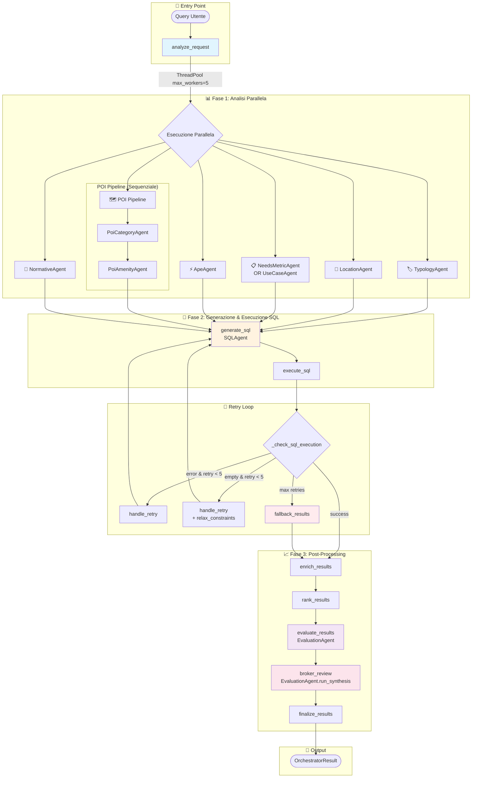
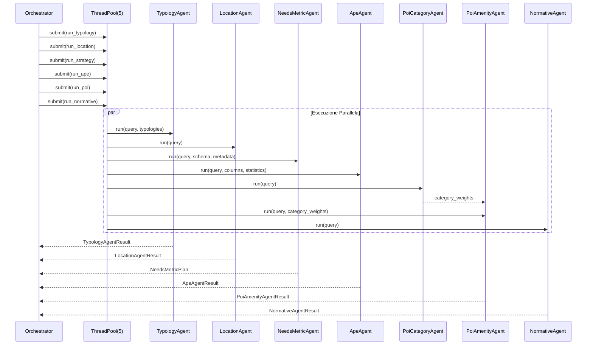
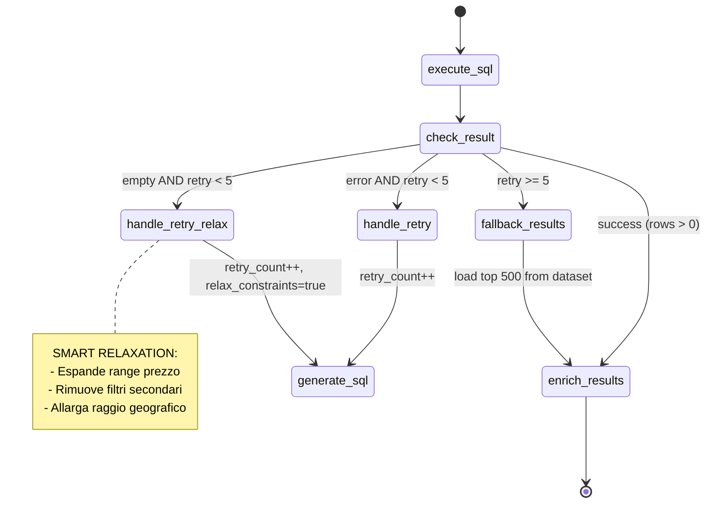
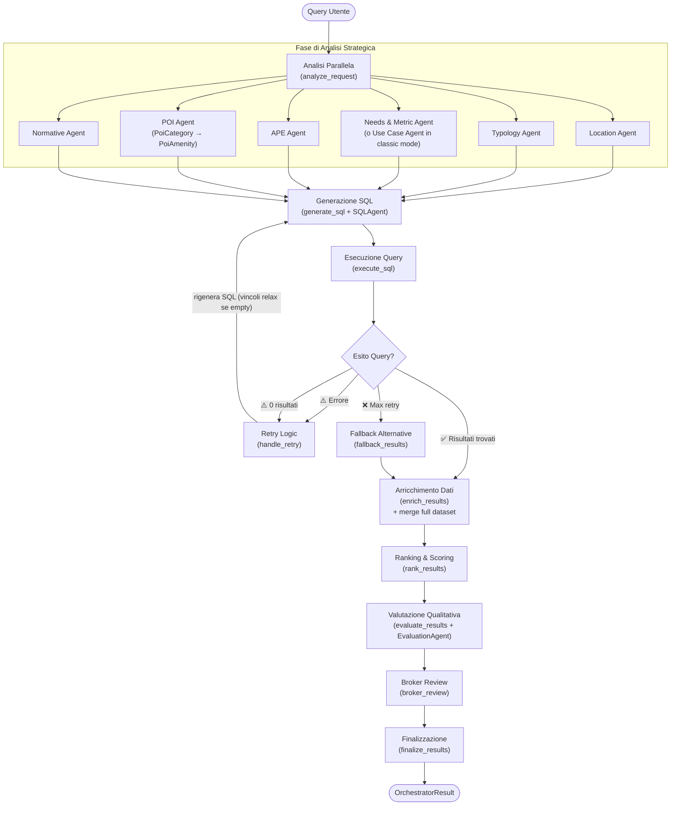

# 🗺️ Architettura Sistema Multi-Agente

> **Documento Generato**: 28 Gennaio 2026  
> **Autore**: Senior AI Architect  
> **Scope**: Reverse Engineering del sistema `backend/app/services/llm/agents/`

---

## 📋 Executive Summary

Il sistema implementa una **pipeline multi-agente orchestrata tramite LangGraph** per l'analisi e valorizzazione di immobili pubblici del MEF (Ministero dell'Economia e delle Finanze). L'architettura si basa su un pattern **StateGraph** con nodi specializzati che eseguono task paralleli dove possibile.

**Componenti Principali:**
- **1 Orchestratore** (GraphOrchestratorAgent) basato su LangGraph
- **11 Agenti Specializzati** con responsabilità distinte
- **Pattern di Retry** con rilassamento automatico dei vincoli
- **Fallback robusto** per garantire sempre risultati

---

## 1. 🔄 Mappa del Sistema (Mermaid)

### 1.1 Grafo Principale di Esecuzione



### 1.2 Dettaglio Chiamate Parallele (ThreadPoolExecutor)



### 1.3 Retry Flow con Smart Relaxation



### 1.4 Diagramma di Flusso (Semplificato)

> Obiettivo: una vista “da decision-maker” del comportamento dell’orchestratore, enfatizzando: **analisi parallela**, **generazione+esecuzione SQL**, **retry**, **ranking/eval**, **fallback**.



### 1.5 Albero Decisionale dell’Orchestratore (Tree)

> Questa vista enfatizza **le decisioni** e i **rami** (successo / retry / fallback) più che la sequenza completa.

```mermaid
graph TD
  Q([Query Utente]) --> AR[analyze_request]

  %% --- Parallel fan-out (analisi iniziale) ---
  AR --> P{{Analisi in parallelo}}
  P --> L[LocationAgent]
  P --> T[TypologyAgent]
  P --> S[NeedsMetricAgent / UseCaseAgent]
  P --> A[ApeAgent]
  P --> N[NormativeAgent]
  P --> PC[PoiCategoryAgent]
  PC --> PA[PoiAmenityAgent]

  %% --- Join verso SQL ---
  L & T & S & A & N & PA --> GS[generate_sql (SQLAgent)]
  GS --> ES[execute_sql]

  %% --- Decision node ---
  ES --> D{_check_sql_execution}

  %% --- Success path ---
  D -->|continue: risultati > 0| ENR[enrich_results]
  ENR --> RK[rank_results]
  RK --> EV[evaluate_results]
  EV --> BR[broker_review]
  BR --> FIN[finalize_results]
  FIN --> OUT([OrchestratorResult])

  %% --- Retry paths (loop) ---
  D -->|retry: execution_error & retry_count < 5| HR1[handle_retry\n(relax_constraints = false)]
  HR1 --> GS

  D -->|retry_relax: 0 risultati & retry_count < 5| HR2[handle_retry\n(relax_constraints = true)]
  HR2 --> GS

  %% --- Fallback path ---
  D -->|fallback: max retry| FB[fallback_results\n(top 500 alternative)]
  FB --> ENR

  %% --- Styling ---
  classDef node fill:#151515,stroke:#6b7280,color:#ffffff;
  classDef decision fill:#111827,stroke:#fbbf24,color:#ffffff;
  classDef warn fill:#111827,stroke:#f87171,color:#ffffff;

  class Q,AR,P,L,T,S,A,N,PC,PA,GS,ES,ENR,RK,EV,BR,FIN,OUT node;
  class D decision;
  class FB warn;
```

---

## 2. 📦 Dettaglio Agenti & Interfacce

### 🤖 GraphOrchestratorAgent (Orchestratore Principale)

**Scopo:** Coordina l'intera pipeline multi-agente usando LangGraph StateGraph.

**Input State (GraphState):**
```json
{
  "query": "Sto valutando un investimento immobiliare a Torino...",
  "dataset_key": "full",
  "base_dataset": "<pd.DataFrame>",
  "dataset_path": "/path/to/dataset.parquet",
  "db_schema": {"IMMOBILI": {"columns": [...]}},
  "db_metadata": {"tipologia_bene_immobile": {"values": ["Abitazione", ...]}},
  "dataset_metadata": {"columns": ["id", "indirizzo", ...], "typologies": [...]},
  "llm_limit": 10,
  "map_limit": 500,
  "metro_graph": "<NetworkX Graph>"
}
```

**Output Schema (OrchestratorResult):**
```json
{
  "map_df": "<pd.DataFrame con tutti i risultati rankati>",
  "location": [["Torino Centro", 45.0677, 7.6825]],
  "status_msg": "Trovati 42 immobili corrispondenti.",
  "gemini_responses": {
    "typology_extraction": {...},
    "location_extraction": {...},
    "sql_generation": {...},
    "evaluation": {...},
    "broker_review": "..."
  },
  "where_clause": "WHERE tipologia = 'Abitazione' AND ...",
  "context": "<AgentContext>",
  "broker_summary": "Executive summary comparativo..."
}
```

---

### 🏷️ TypologyAgent

**Scopo:** Mappa la richiesta utente sulle tipologie immobiliari standardizzate del MEF.

**Input State:**
```json
{
  "query": "Cerco una scuola in centro",
  "available_typologies": "['Abitazione', 'Edificio scolastico', 'Ufficio strutturato', ...]"
}
```

**Output Schema (TypologyAgentResult):**
```json
{
  "raw_text": "{\"typologies\":[\"Edificio scolastico (es.: scuola...)\"]}",
  "typologies": [
    "Edificio scolastico (es.: scuola di ogni ordine e grado, università, scuola di formazione)"
  ],
  "prompt": {
    "system": "Sei il Typology Agent...",
    "user": "Lista delle tipologie disponibili: [...] Richiesta utente: \"...\"",
    "full_text": "[SYSTEM]...[USER]..."
  }
}
```

**Modello LLM:** Configurabile via `settings.agent_models["typology_agent"]`

---

### 📍 LocationAgent

**Scopo:** Estrae riferimenti geografici (città, zone, POI, indirizzi) dalla query.

**Input State:**
```json
{
  "query": "Trilocale vicino al Politecnico di Torino"
}
```

**Output Schema (LocationAgentResult):**
```json
{
  "raw_text": "{\"places\":[{\"name\":\"Politecnico di Torino\",\"city\":\"Torino\"}]}",
  "places": [
    {
      "name": "Politecnico di Torino",
      "city": "Torino",
      "lat": 45.0628,
      "lon": 7.6621
    }
  ],
  "prompt": {
    "system": "Sei il Location Agent...",
    "user": "Frase: \"Trilocale vicino al Politecnico di Torino\"",
    "full_text": "..."
  }
}
```

**Post-Processing:** Geocoding parallelo via `get_coordinates()` con ThreadPoolExecutor.

---

### 📋 NeedsMetricAgent (Modalità "agent")

**Scopo:** Traduce i bisogni dell'utente in metriche di ranking e strategia dataset.

**Input State:**
```json
{
  "query": "Immobili efficienti energeticamente vicino alle scuole",
  "db_schema": "{ IMMOBILI: { superficie_di_riferimento_mq: FLOAT, ... } }",
  "dataset_sample": "id, indirizzo, superficie_di_riferimento_mq, ...",
  "db_metadata": "{...}",
  "categorical_values": {
    "classe_energetica_ape": ["A1", "A2", "B", "C", "D", "E", "F", "G"],
    "tipologia_bene_immobile": ["Abitazione", "Ufficio", ...]
  }
}
```

**Output Schema (NeedsMetricPlan):**
```json
{
  "summary": "L'utente cerca immobili efficienti vicino a scuole",
  "raw_text": "{...}",
  "prompt": {...},
  "metrics": [
    {
      "name": "efficienza_energetica",
      "goal": "Massimizzare classe APE",
      "weight": 0.7,
      "data_points": ["ape_score_total", "classe_energetica_ape"]
    },
    {
      "name": "educazione",
      "goal": "Prossimità scuole",
      "weight": 0.8,
      "data_points": ["educazione"]
    }
  ],
  "dataset_strategy": {
    "filters": ["superficie_di_riferimento_mq >= 50"],
    "sort_by": "educazione DESC",
    "top_k": 500,
    "notes": "Filtro leggero per massimizzare candidati"
  },
  "ape_strategy": {
    "use_ape": true,
    "strategy": "Prioritizzare classi A-B"
  }
}
```

---

### 📝 UseCaseAgent (Modalità "classic")

**Scopo:** Genera un use case strutturato per la valutazione (alternativa a NeedsMetricAgent).

**Input State:**
```json
{
  "query": "Cerco spazi per coworking",
  "db_schema": "{...}"
}
```

**Output Schema (UseCaseResult):**
```json
{
  "raw_text": "{\"description\":\"...\",\"target_audience\":\"...\",\"key_metrics\":[...]}",
  "description": "Spazi per coworking con buona accessibilità e servizi",
  "target_audience": "Startup e professionisti",
  "key_metrics": ["superficie_mq", "accessibilità", "servizi_commerciali"],
  "prompt": {...}
}
```

---

### ⚡ ApeAgent

**Scopo:** Analizza dati APE (Attestato Prestazione Energetica) e suggerisce strategie energetiche.

**Input State:**
```json
{
  "query": "Immobili da ristrutturare con classe F o G",
  "columns": ["classe_energetica_ape", "ape_score_total", "ape_score_involucro", ...],
  "statistics": {
    "total_buildings": 1000,
    "ape_data_available": 267,
    "energy_class_distribution": {"F": 90, "G": 46, "A1": 5, ...}
  },
  "score_legend": "## Legenda Punteggi APE\n..."
}
```

**Output Schema (ApeAgentResult):**
```json
{
  "raw_text": "Per il tuo obiettivo di riqualificazione...",
  "answer": "Per il tuo obiettivo ('comprare sotto-prezzo, riqualificare'), il filtro giusto è immobili con ape_score <= 2 (classe F-G)...",
  "relevant_ape_ids": [],
  "suggested_filters": [
    "classe_energetica_ape IN ('F', 'G')",
    "ape_score_involucro <= 2"
  ],
  "prompt": {...}
}
```

**Nota:** Usa `with_structured_output(ApeAgentOutput)` per garantire output JSON valido.

---

### 🗺️ PoiCategoryAgent

**Scopo:** Identifica le categorie POI (Points of Interest) rilevanti per la richiesta.

**Input State:**
```json
{
  "query": "Appartamento vicino a metro e università"
}
```

**Output Schema (PoiCategoryAgentResult):**
```json
{
  "raw_text": "{\"categories\":[\"mobilita\",\"educazione\"]}",
  "category_weights": {
    "sanita": 0.0,
    "mobilita": 0.5,
    "verde": 0.0,
    "sport": 0.0,
    "commerciale": 0.0,
    "educazione": 1.0
  },
  "prompt": null
}
```

**Categorie Disponibili:** `sanita`, `mobilita`, `verde`, `sport`, `commerciale`, `educazione`

---

### 🏪 PoiAmenityAgent

**Scopo:** Seleziona le specifiche amenity (servizi) rilevanti all'interno delle categorie.

**Input State:**
```json
{
  "query": "Appartamento vicino a metro e università",
  "category_weights": {
    "mobilita": 0.5,
    "educazione": 1.0
  }
}
```

**Output Schema (PoiAmenityAgentResult):**
```json
{
  "raw_text": "{\"amenities\":{\"mobilita\":[\"subway\",\"bus_stop\"],\"educazione\":[\"university\",\"college\"]}}",
  "selected_categories": ["mobilita", "educazione"],
  "selected_amenities": {
    "mobilita": ["subway", "bus_stop"],
    "educazione": ["university", "college"]
  },
  "category_weights": {"mobilita": 0.5, "educazione": 1.0},
  "amenity_weights": {
    "mobilita": {"subway": 0.5, "bus_stop": 0.5, "tram_stop": 0.0},
    "educazione": {"university": 0.5, "college": 0.5, "school": 0.0}
  },
  "prompt": null
}
```

**Dipendenza:** Richiede output di `PoiCategoryAgent` come input.

---

### 📜 NormativeAgent

**Scopo:** Estrae requisiti normativi (superfici minime, altezze, etc.) dalla documentazione.

**Input State:**
```json
{
  "query": "Cerco spazi per asilo nido"
}
```

**Output Schema (NormativeAgentResult):**
```json
{
  "raw_text": "{\"requisiti\":[...]}",
  "normative_info": "{\"requisiti\":[{\"categoria\":\"superfici_minime_massime\",\"tipo\":\"locale abitativo\",\"valore\":14,\"unita\":\"mq\",\"normativa\":\"D.M. 5/7/1975\"}]}",
  "sources": ["docs/knowledge/normativa/dm_1975.md"],
  "prompt": {...}
}
```

**Fonte Dati:** Legge documenti da `backend/docs/knowledge/normativa/` (supporta .txt, .md, immagini).

---

### 🔍 SQLAgent

**Scopo:** Genera query SQL DuckDB ottimizzate per filtrare il dataset immobiliare.

**Input State:**
```json
{
  "query": "Appartamenti entro 3km dal Politecnico classe F o G",
  "scheme": "IMMOBILI(id, indirizzo, latitudine, longitudine, classe_energetica_ape, ...)",
  "location": {"lat": 45.0628, "lon": 7.6621},
  "db_metadata": "{...}",
  "failed_query": null,
  "error_msg": null
}
```

**Output Schema (SQLAgentResult):**
```json
{
  "sql_query": "SELECT i.* FROM IMMOBILI AS i WHERE i.classe_energetica_ape IN ('F', 'G') AND haversine_km(i.latitudine, i.longitudine, 45.0628, 7.6621) < 3 ORDER BY haversine_km(...) ASC;",
  "explanation": null,
  "raw_text": "SELECT...",
  "prompt": {...}
}
```

**Funzione Speciale:** `haversine_km(lat1, lon1, lat2, lon2)` per calcolo distanze.

**Retry Mode:** Riceve `failed_query` e `error_msg` per correggere errori.

---

### 🎯 EvaluationAgent

**Scopo:** Valuta qualitativamente gli immobili candidati con scoring 0-100.

**Input State:**
```json
{
  "use_case": "L'utente cerca immobili da ristrutturare per affitto studenti...",
  "estates_data": "[{\"id\":695259,\"indirizzo\":\"Via Venti Settembre 57\",\"classe_energetica_ape\":\"F\",...}]",
  "original_query": "Sto valutando un investimento immobiliare a Torino...",
  "score_legend": "## Scoring (0-100):\n- 90-100 (Top Prospect)..."
}
```

**Output Schema (EvaluationAgentResponse):**
```json
{
  "prompt": {...},
  "raw_text": "[{\"id\":695259,\"evaluation_text\":\"...\",\"score\":88,...}]",
  "results": [
    {
      "id": 695259,
      "evaluation_text": "Ottimo candidato per riqualificazione. Posizione strategica...",
      "score": 88,
      "pros": ["Posizione centrale", "Classe F = alto potenziale uplift"],
      "cons": ["Possibili vincoli storico-artistici"]
    }
  ]
}
```

**Batch Processing:** Esegue in batch da 5 con ThreadPoolExecutor(max_workers=4).

---

### 👔 Broker Review (via EvaluationAgent.run_synthesis)

**Scopo:** Genera executive summary comparativo per il decisore finale.

**Input State:**
```json
{
  "query": "Sto valutando un investimento immobiliare a Torino...",
  "candidates_data": "Candidato #1 (ID: 695259, Score: 88):\nMotivazione: ...\nPro: ...\nContro: ...\n---\nCandidato #2..."
}
```

**Output:** Stringa testuale (executive summary 10-12 righe).

---

### 💬 MapAssistantAgent (Standalone)

**Scopo:** Assistente conversazionale per la mappa interattiva (filtri, reset, domande).

**Input State:**
```json
{
  "message": "Mostrami solo gli uffici",
  "context": "<AgentContext con risultati correnti>",
  "current_filters": {"tipologia": null},
  "chat_history": ["Utente: Quali sono i migliori?", "AI: Il migliore è..."]
}
```

**Output Schema (MapAssistantResponse):**
```json
{
  "response_text": "Ho filtrato i risultati mostrando solo gli uffici. Ora vedi 15 immobili.",
  "action": {
    "action_type": "filter",
    "filter_field": "tipologia",
    "filter_value": "Ufficio",
    "reasoning": "L'utente ha chiesto di filtrare per uffici"
  },
  "prompt": {...}
}
```

**Action Types:** `filter`, `reset`, `rerun`, `none`

---

## 3. 🔬 Analisi Critica & Ridondanza

### ✅ Cosa Funziona Bene

| Aspetto | Valutazione | Note |
|---------|-------------|------|
| **Parallelizzazione** | ⭐⭐⭐⭐⭐ | ThreadPoolExecutor(5) per analisi iniziale riduce latenza ~60% |
| **Retry con Relaxation** | ⭐⭐⭐⭐ | Smart relaxation evita risultati vuoti |
| **Fallback Robusto** | ⭐⭐⭐⭐ | Sempre restituisce qualcosa (top 500 per distance/APE) |
| **Separazione Responsabilità** | ⭐⭐⭐⭐ | Ogni agente ha un compito ben definito |
| **Tracciabilità** | ⭐⭐⭐⭐⭐ | PromptRecord su ogni agente + gemini_responses completo |
| **Structured Output** | ⭐⭐⭐⭐ | Pydantic models + `with_structured_output()` dove supportato |

### ⚠️ Aree di Ridondanza (Da Ottimizzare)

#### 1. **POI Pipeline Sequenziale Forzata**
```
PoiCategoryAgent → PoiAmenityAgent (dipendenza seriale)
```
**Problema:** All'interno del ThreadPool, `run_poi()` esegue sequenzialmente entrambi gli agenti.  
**Impatto:** +1 chiamata LLM in serie, aumenta latenza complessiva.  
**Soluzione Proposta:** 
- Fusione in un singolo `PoiAgent` che restituisce sia categorie che amenity.
- Oppure: cache delle categorie per evitare ricalcolo.

#### 2. **NeedsMetricAgent vs UseCaseAgent (Overlap Concettuale)**
```python
if self.is_agent_mode:
    return self.needs_agent.run(...)  # NeedsMetricPlan
else:
    return self.use_case_agent.run(...)  # UseCaseResult
```
**Problema:** Due agenti che fanno essenzialmente lo stesso lavoro (analisi bisogni), ma con output diversi.  
**Impatto:** Duplicazione di logica e prompt simili.  
**Soluzione Proposta:** Unificare in un unico `StrategyAgent` con output polimorfico.

#### 3. **ApeAgent e NeedsMetricAgent: Sovrapposizione su Metriche Energetiche**
**Problema:** Entrambi analizzano requisiti energetici. `ApeAgent` suggerisce filtri APE, `NeedsMetricAgent` include metriche `efficienza_energetica`.  
**Impatto:** Possibili conflitti nelle raccomandazioni (es. uno dice "F-G", l'altro "A-B").  
**Soluzione Proposta:** 
- `ApeAgent` diventa un **sub-componente** di `NeedsMetricAgent`.
- Oppure: `ApeAgent` viene chiamato solo se `metrics_plan.ape_strategy.use_ape == true`.

#### 4. **Geocoding Parallelo Separato**
```python
with ThreadPoolExecutor(max_workers=5) as executor:
    futures = [executor.submit(geocode_place, p) for p in loc_result.places]
```
**Problema:** Secondo ThreadPoolExecutor nested all'interno del primo (analisi).  
**Impatto:** Overhead di context switching, potenziale thread starvation.  
**Soluzione Proposta:** Integrare geocoding nel `LocationAgent` stesso o usare async.

#### 5. **EvaluationAgent Doppio Ruolo (Evaluation + Broker)**
```python
self.evaluation_agent.run(...)  # Valutazione singoli immobili
self.evaluation_agent.run_synthesis(...)  # Executive summary
```
**Problema:** Un agente con due metodi semanticamente diversi.  
**Impatto:** Viola Single Responsibility Principle. Prompt e chain diversi.  
**Soluzione Proposta:** Estrarre `BrokerAgent` come classe separata.

### ❌ Criticità Identificate

#### 1. **🔴 Bottleneck: Batch Evaluation Sequenziale**
```python
batches = [eval_input_df[i:i+batch_size] for i in range(0, len(eval_input_df), batch_size)]
# ThreadPool(4) ma max 5 batch = max 25 items totali
```
**Problema:** Con `llm_cap=10` e `batch_size=5`, massimo 2 batch. Il parallelismo è sottoutilizzato.  
**Impatto:** Latenza elevata se `llm_cap` aumenta.  
**Raccomandazione:** Aumentare batch_size o usare streaming.

#### 2. **🔴 State Bloat: base_dataset in GraphState**
```python
"base_dataset": base_dataset,  # INTERO DataFrame passato nello state
```
**Problema:** LangGraph serializza/deserializza lo state ad ogni nodo. DataFrame grandi = overhead memoria.  
**Impatto:** Memory pressure, potenziali OOM con dataset > 100k rows.  
**Raccomandazione:** Passare solo `dataset_path` e caricare on-demand.

#### 3. **🟡 Normative Agent: Parsing Fragile di Documenti**
```python
for file_path in normative_dir.rglob("*"):
    if file_path.suffix.lower() in [".txt", ".md", ...]:
        content = f.read()
```
**Problema:** Nessun chunking o embedding. Documenti lunghi = token overflow.  
**Impatto:** Errori su documenti > 8k token.  
**Raccomandazione:** Implementare RAG con vector store (Chroma/Pinecone).

#### 4. **🟡 LocationAgent: Geocoding Sincrono Bloccante**
**Problema:** `get_coordinates()` fa chiamate HTTP sincrone (geopy).  
**Impatto:** Se l'API geocoding è lenta, blocca tutto.  
**Raccomandazione:** Cache persistente + async geocoding.

#### 5. **🟡 Mancanza di Circuit Breaker**
**Problema:** Se un agente fallisce ripetutamente, non c'è meccanismo per "spegnerlo".  
**Impatto:** Retry infiniti su servizi degradati.  
**Raccomandazione:** Implementare circuit breaker pattern con fallback graceful.

---

## 4. 📊 Matrice Dipendenze Agenti

| Agente | Input Da | Output Verso | Tipo Dipendenza |
|--------|----------|--------------|-----------------|
| TypologyAgent | Query | SQLAgent | Soft (opzionale) |
| LocationAgent | Query | SQLAgent, Ranking | Hard (geocoding) |
| NeedsMetricAgent | Query, Schema | SQLAgent, Ranking | Hard |
| ApeAgent | Query, Statistics | NeedsMetricPlan | Soft (merge) |
| PoiCategoryAgent | Query | PoiAmenityAgent | Hard (blocking) |
| PoiAmenityAgent | Query, CategoryWeights | Ranking | Hard |
| NormativeAgent | Query | SQLAgent (augmented) | Soft |
| SQLAgent | All above | Execute SQL | Hard |
| EvaluationAgent | SQL Results | Broker, UI | Hard |

---

## 5. 🎯 Conclusioni & Raccomandazioni

### Giudizio Architetturale

L'architettura è **ben progettata** per il problema specifico (analisi immobiliare multi-criterio), ma presenta segni di **over-engineering** in alcune aree:

| Aspetto | Stato | Priorità Fix |
|---------|-------|--------------|
| Numero Agenti | 11 agenti → potenzialmente riducibili a 7-8 | 🟡 Media |
| Complessità LangGraph | Giustificata per retry/fallback | ✅ OK |
| Parallelizzazione | Efficace ma con overhead nested | 🟡 Media |
| Accoppiamento | Basso grazie a schema Pydantic | ✅ OK |

### Raccomandazioni Prioritizzate

1. **[P1] Fondere PoiCategoryAgent + PoiAmenityAgent** → Riduce 1 chiamata LLM
2. **[P1] Rimuovere base_dataset dallo state** → Riduce memory footprint
3. **[P2] Estrarre BrokerAgent** → Migliora SRP
4. **[P2] Implementare RAG per NormativeAgent** → Supporta documenti lunghi
5. **[P3] Unificare NeedsMetricAgent + UseCaseAgent** → Riduce duplicazione
6. **[P3] Async Geocoding** → Riduce latenza I/O bound

### Metriche Chiave da Monitorare

```
📊 KPI Suggeriti:
- avg_pipeline_latency_ms
- llm_calls_per_request
- retry_rate_percentage
- fallback_activation_rate
- memory_peak_mb
```

---

## 📎 Appendice: Configurazione Modelli

```python
# Da settings.agent_models
AGENT_MODELS = {
    "default": "gemini-1.5-flash",
    "typology_agent": "gemini-1.5-flash",
    "location_agent": "gemini-1.5-flash",
    "needs_metric_agent": "gemini-1.5-flash",
    "sql_agent": "gemini-1.5-flash",
    "evaluation_agent": "gemini-1.5-pro",  # Pro per valutazioni complesse
    "ape_agent": "gemini-1.5-flash",
    "poi_category_agent": "gemini-1.5-flash",
    "poi_amenity_agent": "gemini-1.5-flash",
    "normative_agent": "gemini-1.5-pro",  # Pro per documenti
    "map_assistant": "gemini-1.5-flash"
}
```

---

> **Nota Finale:** Questa architettura rappresenta un buon equilibrio tra modularità e performance. Le ottimizzazioni suggerite sono evolutive, non rivoluzionarie. Il sistema è production-ready con le criticità identificate come "nice-to-have" per scale superiori.
