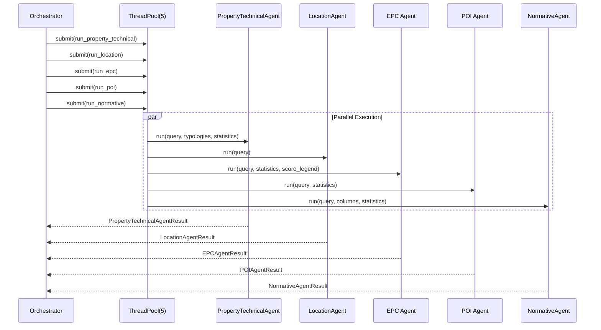
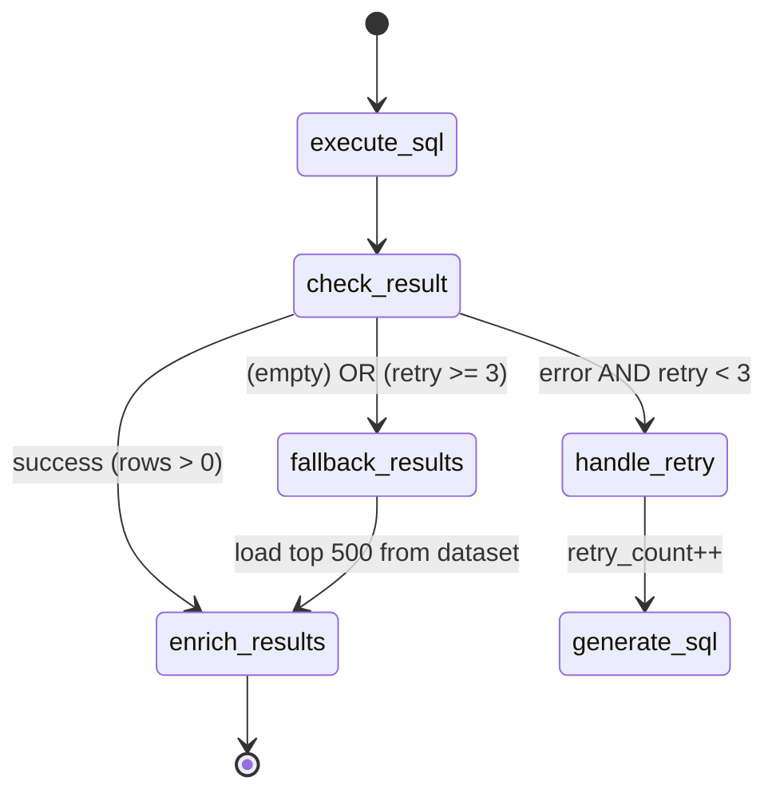

# 🗺️ Multi-Agent System Architecture

> **Updated Document**: March 2026
> **Author**: AI Systems Architect
> **Scope**: Current system architecture of `backend/app/services/llm/agents/`

---

## 📋 Executive Summary

The system implements a **multi-agent pipeline orchestrated via LangGraph** for the analysis and valuation of public real estate assets for a **Subject Organization**. The architecture is based on a **StateGraph** pattern with specialized nodes performing parallel tasks where possible.

**Core Components:**
- **1 Orchestrator** (GraphOrchestratorAgent) based on LangGraph.
- **8 Specialized Agents** with distinct responsibilities.
- **Retry Pattern** for SQL error correction.
- **Robust Fallback** to ensure results are always returned.

---

## 1. 🔄 System Map (Mermaid)

### 1.1 Main Execution Graph


### 1.2 Parallel Calls Detail (ThreadPoolExecutor)



### 1.3 SQL Execution Flow



---

## 2. 📦 Agent Details & Interfaces

### 🤖 GraphOrchestratorAgent (Main Orchestrator)

**Purpose:** Coordinates the entire multi-agent pipeline using LangGraph StateGraph.

**Input State (GraphState):**
```json
{
  "query": "Evaluating real estate investment in Turin...",
  "dataset_key": "full",
  "base_dataset": "<pd.DataFrame>",
  "dataset_path": "/path/to/dataset.parquet",
  "db_schema": {"IMMOBILI": {"columns": [...]}},
  "db_metadata": {"property_type": {"values": ["Residential", ...]}},
  "dataset_metadata": {"columns": ["id", "address", ...], "typologies": [...]},
  "llm_limit": 10,
  "map_limit": 500,
  "metro_graph": "<NetworkX Graph>"
}
```

**Output Schema (OrchestratorResult):**
```json
{
  "map_df": "<pd.DataFrame with all ranked results>",
  "location": [["Turin Center", 45.0677, 7.6825]],
  "status_msg": "Found 42 matching properties.",
  "gemini_responses": {
    "property_technical_extraction": {...},
    "location_extraction": {...},
    "sql_generation": {...},
    "evaluation": {...},
    "broker_review": "..."
  },
  "where_clause": "WHERE typology = 'Residential' AND ...",
  "context": "<AgentContext>",
  "broker_summary": "Comparative executive summary..."
}
```

---

### 🏷️ PropertyTechnicalAgent

**Purpose:** Analyzes the user request to identify planimetric, technical, cadastral, and typological characteristics of properties.

**Input State:**
```json
{
  "query": "Looking for a school in the center",
  "available_typologies": "['Residential', 'School Building', 'Structured Office', ...]"
}
```

**Output Schema (PropertyTechnicalAgentResult):**
```json
{
  "raw_text": "{\"typologies\":[\"School Building (e.g.: school...)\"]}",
  "typologies": [
    "School Building (e.g.: school of every grade, university, training school)"
  ],
  "prompt": {
    "system": "You are an expert in planimetric characteristics...",
    "user": "List of available typologies: [...] User request: \"...\"",
    "full_text": "[SYSTEM]...[USER]..."
  }
}
```

**LLM Model:** Configurable via `settings.agent_models["property_technical_agent"]`.

---

### 📍 LocationAgent

**Purpose:** Extracts geographical references (cities, zones, POIs, addresses) from the query.

**Input State:**
```json
{
  "query": "Three-room apartment near the Polytechnic of Turin"
}
```

**Output Schema (LocationAgentResult):**
```json
{
  "raw_text": "{\"places\":[{\"name\":\"Polytechnic of Turin\",\"city\":\"Turin\"}]}",
  "places": [
    {
      "name": "Polytechnic of Turin",
      "city": "Turin",
      "lat": 45.0628,
      "lon": 7.6621
    }
  ],
  "prompt": {
    "system": "You are the Location Agent...",
    "user": "Query: \"Three-room apartment near the Polytechnic of Turin\"",
    "full_text": "..."
  }
}
```

**Post-Processing:** Parallel geocoding via `get_coordinates()` with ThreadPoolExecutor.

---

### ⚡ EPCAgent

**Purpose:** Analyzes EPC (Energy Performance Certificate) data and suggests energy efficiency strategies.

**Input State:**
```json
{
  "query": "Properties to renovate with class F or G",
  "columns": ["energy_class_epc", "epc_score_total", "epc_score_envelope", ...],
  "statistics": {
    "total_buildings": 1000,
    "epc_data_available": 267,
    "energy_class_distribution": {"F": 90, "G": 46, "A1": 5, ...}
  },
  "score_legend": "## EPC Scoring Legend\n..."
}
```

**Output Schema (EPCAgentResult):**
```json
{
  "raw_text": "For your renovation goal...",
  "answer": "For your goal ('buy under-market, renovate'), the right filter is properties with epc_score <= 2 (class F-G)...",
  "relevant_epc_ids": [],
  "suggested_filters": [
    "energy_class_epc IN ('F', 'G')",
    "epc_score_envelope <= 2"
  ],
  "prompt": {...}
}
```

**Note:** Uses `with_structured_output(EPCAgentOutput)` to ensure valid JSON output.

---

### 🗺️ POIAgent

**Purpose:** Identifies relevant POI (Points of Interest) categories and required minimum scores for the query.

**Input State:**
```json
{
  "query": "Apartment near metro and university",
  "mode": "filtering",
  "statistics": {
    "health": {"mean": 2.3, "max": 5.0},
    "mobility": {"mean": 3.1, "max": 5.0},
    "education": {"mean": 2.8, "max": 5.0}
  }
}
```

**Output Schema (POIAgentResult):**
```json
{
  "raw_text": "{\"found\":true,\"categories\":[\"mobility\",\"education\"],\"min_scores\":{\"mobility\":3.5,\"education\":4.0}}",
  "found": true,
  "categories": ["mobility", "education"],
  "min_scores": {
    "mobility": 3.5,
    "education": 4.0
  },
  "prompt": {...}
}
```

**Available Categories:** `health`, `mobility`, `green`, `sport`, `commercial`, `education`.

---

### 📜 NormativeAgent

**Purpose:** Extracts regulatory requirements (minimum surfaces, heights, etc.) from documentation.

**Input State:**
```json
{
  "query": "Looking for nursery school spaces"
}
```

**Output Schema (NormativeAgentResult):**
```json
{
  "raw_text": "{\"requirements\":[...]}",
  "normative_info": "{\"requirements\":[{\"category\":\"min_max_surfaces\",\"type\":\"residential unit\",\"value\":14,\"unit\":\"sqm\",\"regulation\":\"D.M. 5/7/1975\"}]}",
  "sources": ["docs/knowledge/normative/dm_1975.md"],
  "prompt": {...}
}
```

**Data Source:** Reads documents from `backend/docs/knowledge/normative/` (supports .txt, .md, images).

---

### 🔍 SQLAgent

**Purpose:** Generates optimized DuckDB SQL queries to filter the real estate dataset.

**Input State:**
```json
{
  "query": "Apartments within 3km from Polytechnic class F or G",
  "scheme": "IMMOBILI(id, address, latitude, longitude, energy_class_epc, ...)",
  "location": {"lat": 45.0628, "lon": 7.6621},
  "db_metadata": "{...}",
  "failed_query": null,
  "error_msg": null
}
```

**Output Schema (SQLAgentResult):**
```json
{
  "sql_query": "SELECT i.* FROM IMMOBILI AS i WHERE i.energy_class_epc IN ('F', 'G') AND haversine_km(i.lat, i.lon, 45.0628, 7.6621) < 3 ORDER BY haversine_km(...) ASC;",
  "explanation": null,
  "raw_text": "SELECT...",
  "prompt": {...}
}
```

**Special Function:** `haversine_km(lat1, lon1, lat2, lon2)` for distance calculation.

---

### 🎯 EvaluationAgent

**Purpose:** Qualitatively evaluates candidate properties with a 0-100 scoring system.

**Input State:**
```json
{
  "use_case": "The user is looking for properties to renovate for student rentals...",
  "estates_data": "[{\"id\":695259,\"address\":\"Via Venti Settembre 57\",\"energy_class_epc\":\"F\",...}]",
  "original_query": "Evaluating real estate investment in Turin...",
  "score_legend": "## Scoring (0-100):\n- 90-100 (Top Prospect)..."
}
```

**Output Schema (EvaluationAgentResponse):**
```json
{
  "prompt": {...},
  "raw_text": "[{\"id\":695259,\"evaluation_text\":\"...\",\"score\":88,...}]",
  "results": [
    {
      "id": 695259,
      "evaluation_text": "Excellent renovation candidate. Strategic position...",
      "score": 88,
      "pros": ["Central position", "Class F = high potential uplift"],
      "cons": ["Possible historical-artistic constraints"]
    }
  ]
}
```

**Batch Processing:** Executes in batches of 5 with ThreadPoolExecutor(max_workers=4).

---

### 🎚️ RankingAgent

**Purpose:** Determines weights for the multi-criteria ranking system based on user query analysis.

**Input State:**
```json
{
  "query": "Looking for properties near schools with good energy class",
  "mode": "ranking"
}
```

**Output Schema (RankingAgentResult):**
```json
{
  "raw_text": "{\"ranking\":[\"poi\",\"epc\",\"location\",\"typology\",\"normative\"],\"weights\":{...}}",
  "weights": {
    "location": 0.3,
    "normative": 0.1,
    "epc": 0.3,
    "property_technical": 0.1,
    "poi": 0.4
  },
  "prompt": {...}
}
```

---

## 3. 🔬 Critical Analysis & Redundancy

### ✅ Strengths

| Aspect | Rating | Notes |
|---------|-------------|------|
| **Parallelization** | ⭐⭐⭐⭐⭐ | ThreadPoolExecutor(5) for initial analysis reduces latency by ~60% |
| **Retry Logic** | ⭐⭐⭐⭐ | Effectively corrects SQL syntax errors |
| **Robust Fallback** | ⭐⭐⭐⭐ | Always returns results (top 500 by distance/EPC) |
| **Traceability** | ⭐⭐⭐⭐⭐ | PromptRecord on every agent + complete gemini_responses |

### ⚠️ Implementation Improvements

#### 1. **✅ Unified POI Pipeline** (RESOLVED)
Reduced LLM calls and latency by merging redundant POI agents into a single unified agent.

#### 2. **✅ Dedicated Ranking Agent** (RESOLVED)
Introduced a specialized agent to dynamically calculate weights, separating analysis from final scoring.

---

## 4. 🎯 Conclusion & Recommendations

The current architecture is **optimized and well-balanced** for multi-criteria real estate analysis. The agents have been rationalized from 11 down to 8, eliminating redundancies and clarifying responsibilities.

### Final Metrics to Monitor

```
📊 Suggested KPIs:
- avg_pipeline_latency_ms
- llm_calls_per_request (Target: ~8-9)
- retry_rate_percentage
- fallback_activation_rate
```
