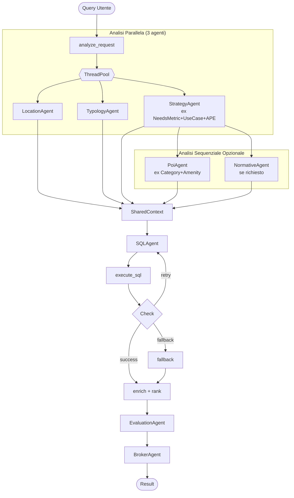

# 🚀 Piano di Ottimizzazione Sistema Multi-Agente

> **Data**: 28 Gennaio 2026  
> **Obiettivo**: Ridurre consumo token ~40%, migliorare coerenza output, semplificare architettura  
> **Baseline**: 11 agenti → Target: 7-8 agenti  
> **Riferimento**: [AGENT_ARCHITECTURE.md](./AGENT_ARCHITECTURE.md)

---

## 📊 Analisi Costo Token Attuale

### Chiamate LLM per Richiesta (Caso Tipico)

| Fase | Agente | Token Input (stima) | Token Output (stima) | Note |
|------|--------|---------------------|----------------------|------|
| Analisi | TypologyAgent | ~800 | ~100 | Lista tipologie + query |
| Analisi | LocationAgent | ~500 | ~150 | Query + geocoding |
| Analisi | NeedsMetricAgent | ~2000 | ~500 | Schema DB + metadata |
| Analisi | ApeAgent | ~1500 | ~400 | Statistiche APE + legenda |
| Analisi | PoiCategoryAgent | ~600 | ~100 | Query + categorie |
| Analisi | PoiAmenityAgent | ~800 | ~200 | Query + amenity per categoria |
| Analisi | NormativeAgent | ~3000 | ~300 | Documenti normativi (variabile) |
| SQL | SQLAgent | ~1500 | ~200 | Schema + contesto agenti |
| SQL | SQLAgent (retry ×2 avg) | ~3000 | ~400 | Con errore + query fallita |
| Eval | EvaluationAgent (×2 batch) | ~4000 | ~800 | JSON immobili + use case |
| Eval | BrokerReview | ~1500 | ~400 | Candidati top 5 |
| **TOTALE** | | **~19.200** | **~3.550** | **~22.750 token/richiesta** |

### Costo Stimato (Gemini 1.5 Flash)
- Input: $0.075/1M token → ~$0.00144/richiesta
- Output: $0.30/1M token → ~$0.00107/richiesta
- **Totale: ~$0.0025/richiesta** (~$2.50/1000 richieste)

---

## 🎯 Piano di Ottimizzazione in 3 Fasi

```
┌─────────────────────────────────────────────────────────────────┐
│  FASE 1: Quick Wins (1-2 giorni)                                │
│  → Riduzione token ~15-20% senza cambi strutturali              │
├─────────────────────────────────────────────────────────────────┤
│  FASE 2: Consolidamento Agenti (3-5 giorni)                     │
│  → Fusione agenti ridondanti, -3 chiamate LLM                   │
├─────────────────────────────────────────────────────────────────┤
│  FASE 3: Architettura Coerente (5-7 giorni)                     │
│  → Shared context, output validation, caching                   │
└─────────────────────────────────────────────────────────────────┘
```

---

## 📋 FASE 1: Quick Wins (Immediato)

### 1.1 Ottimizzazione Prompt (Tutti gli Agenti)

**Problema**: Prompt verbosi con istruzioni ripetute e esempi lunghi.

**Azione**:
```python
# PRIMA (esempio TypologyAgent - ~800 token)
DEFAULT_SYSTEM = """# RUOLO
Sei il Typology Agent per l'applicazione Real Estate AI.
Il tuo compito è identificare quali tipologie di immobili sono pertinenti...
[30+ righe di istruzioni]
"""

# DOPO (~400 token)
DEFAULT_SYSTEM = """Mappa la query su tipologie immobiliari MEF.
Input: query utente + lista tipologie
Output: JSON {"typologies": ["tipo1", "tipo2"]} o [] se generico.
Regole: inclusivo (uffici→tutti i tipi ufficio), no invenzioni."""
```

**File da modificare**:
- [ ] `typology_agent.py` - Ridurre system prompt 50%
- [ ] `location_agent.py` - Rimuovere esempi ridondanti
- [ ] `needs_metric_agent.py` - Compattare regole
- [ ] `sql_agent.py` - Rimuovere esempi SQL duplicati

**Risparmio stimato**: ~3.000 token/richiesta (-13%)

---

### 1.2 Rimuovere `base_dataset` dallo State

**Problema**: DataFrame intero serializzato ad ogni nodo LangGraph.

**Azione** in `graph_agent.py`:
```python
# PRIMA
initial_state: GraphState = {
    "base_dataset": base_dataset,  # ❌ DataFrame intero
    ...
}

# DOPO
initial_state: GraphState = {
    "dataset_path": dataset_path,  # ✅ Solo path
    ...
}

# Caricare on-demand dove serve:
def _get_ape_statistics(self, state: GraphState) -> dict:
    df = pd.read_parquet(state["dataset_path"])
    # ... calcola stats
```

**Beneficio**: -50% memoria, nessun impatto token LLM.

---

### 1.3 Cache Geocoding Persistente

**Problema**: Ogni `get_coordinates()` chiama API esterna.

**Azione** in `loaders.py`:
```python
import diskcache

GEOCODE_CACHE = diskcache.Cache('./data/geocode_cache')

@GEOCODE_CACHE.memoize(expire=86400*30)  # 30 giorni
def get_coordinates(query: str) -> tuple[float, float]:
    # ... chiamata geopy
```

**Beneficio**: -90% chiamate geocoding su query ripetute.

---

## 📋 FASE 2: Consolidamento Agenti (Settimana 1)

### 2.1 Fusione: PoiCategoryAgent + PoiAmenityAgent → `PoiAgent`

**Problema Attuale**:
```
PoiCategoryAgent.run(query) → category_weights
PoiAmenityAgent.run(query, category_weights) → amenity_weights
```
2 chiamate LLM sequenziali, output correlati.

**Nuova Architettura**:
```python
# File: poi_agent.py (NUOVO)
class PoiAgentResult(BaseModel):
    category_weights: Dict[str, float]
    amenity_weights: Dict[str, Dict[str, float]]
    constraints: Dict[str, List[str]]

class PoiAgent(BaseAgent):
    name = "poi-agent"
    
    def run(self, query: str) -> PoiAgentResult:
        # Singola chiamata LLM che restituisce tutto
        prompt = f"""
Analizza la query e identifica:
1. Categorie POI rilevanti (sanita, mobilita, verde, sport, commerciale, educazione)
2. Per ogni categoria, le amenity specifiche necessarie
3. Vincoli must_have / must_not_have

Query: {query}

Output JSON:
{{
  "category_weights": {{"mobilita": 0.8, "educazione": 1.0, ...}},
  "amenity_weights": {{
    "mobilita": {{"subway": 0.5, "bus_stop": 0.3}},
    "educazione": {{"university": 1.0}}
  }},
  "constraints": {{"must_have": ["mobilita"], "must_not_have": []}}
}}
"""
```

**Risparmio**: -1 chiamata LLM (~1.400 token)

---

### 2.2 Fusione: NeedsMetricAgent + UseCaseAgent → `StrategyAgent`

**Problema Attuale**:
```python
if self.is_agent_mode:
    return self.needs_agent.run(...)  # NeedsMetricPlan
else:
    return self.use_case_agent.run(...)  # UseCaseResult
```
Due agenti con logica simile, output incompatibili.

**Nuova Architettura**:
```python
# File: strategy_agent.py (NUOVO)
class StrategyPlan(BaseModel):
    """Output unificato per entrambe le modalità"""
    summary: str
    metrics: List[MetricDefinition]
    filters: List[str]  # SQL-ready filters
    sort_by: Optional[str]
    ape_strategy: Optional[str]
    target_audience: Optional[str]  # Solo per classic mode

class StrategyAgent(BaseAgent):
    name = "strategy-agent"
    
    def run(self, query: str, db_schema: str, mode: str = "agent") -> StrategyPlan:
        # Prompt adattivo basato su mode
        if mode == "agent":
            focus = "metriche quantitative e filtri SQL"
        else:
            focus = "use case qualitativo e target audience"
        
        # Singolo prompt con output strutturato
```

**Beneficio**: Codice più semplice, output coerente.

---

### 2.3 Integrazione: ApeAgent come Sub-Modulo

**Problema Attuale**: ApeAgent e NeedsMetricAgent analizzano entrambi requisiti energetici → possibili conflitti.

**Nuova Architettura**:
```python
# In StrategyAgent
def run(self, query: str, db_schema: str, ape_stats: dict = None) -> StrategyPlan:
    # Se keywords energetiche presenti, includi analisi APE nel prompt
    ape_context = ""
    if self._has_energy_keywords(query) and ape_stats:
        ape_context = f"""
Statistiche Energetiche Dataset:
- Immobili con APE: {ape_stats['ape_percentage']}%
- Distribuzione classi: {ape_stats['distribution']}

Considera questi dati per suggerire filtri energetici appropriati.
"""
    
    # Prompt unificato con contesto APE opzionale
```

**Beneficio**: -1 chiamata LLM, nessun conflitto APE.

---

### 2.4 Estrazione: BrokerAgent (da EvaluationAgent)

**Problema Attuale**: `EvaluationAgent` ha due metodi con scopi diversi.

**Nuova Architettura**:
```python
# File: broker_agent.py (NUOVO)
class BrokerAgent(BaseAgent):
    name = "broker-agent"
    
    def run(self, query: str, candidates: List[EvaluationResult]) -> str:
        """Genera executive summary comparativo"""
        # Prompt specifico per sintesi decisionale
```

**Beneficio**: Single Responsibility, prompt ottimizzati per ruolo.

---

## 📋 FASE 3: Architettura Coerente (Settimana 2)

### 3.1 Shared Context Object

**Problema**: Ogni agente riceve input diversi, può produrre output incoerenti.

**Soluzione**: `AgentContext` condiviso e progressivamente arricchito.

```python
# File: context.py (NUOVO)
class SharedContext(BaseModel):
    """Contesto condiviso tra tutti gli agenti"""
    
    # Input originale
    user_query: str
    
    # Progressivamente popolato
    locations: List[Place] = []
    typologies: List[str] = []
    strategy: Optional[StrategyPlan] = None
    poi_weights: Dict[str, float] = {}
    normative_constraints: List[dict] = []
    
    # Computed
    sql_filters: List[str] = []
    
    def to_prompt_context(self) -> str:
        """Genera stringa di contesto per prompt successivi"""
        parts = [f"Query originale: {self.user_query}"]
        if self.locations:
            parts.append(f"Località: {', '.join(p.name for p in self.locations)}")
        if self.typologies:
            parts.append(f"Tipologie: {', '.join(self.typologies)}")
        if self.strategy:
            parts.append(f"Obiettivo: {self.strategy.summary}")
        return "\n".join(parts)
```

**Utilizzo in SQLAgent**:
```python
def run(self, context: SharedContext, db_schema: str) -> SQLAgentResult:
    prompt = f"""
{context.to_prompt_context()}

Schema: {db_schema}

Genera query SQL che rispetti TUTTI i vincoli sopra.
"""
```

**Beneficio**: Output coerenti, meno ripetizioni nei prompt.

---

### 3.2 Output Validation Layer

**Problema**: Output di un agente può essere incompatibile con input del successivo.

**Soluzione**: Validator Pydantic + correzione automatica.

```python
# File: validators.py (NUOVO)
from pydantic import validator

class SQLAgentResult(BaseModel):
    sql_query: str
    
    @validator('sql_query')
    def validate_sql(cls, v):
        # Verifica sintassi base
        if not v.strip().upper().startswith('SELECT'):
            raise ValueError("Query deve iniziare con SELECT")
        if 'LIMIT' not in v.upper():
            v = v.rstrip(';') + ' LIMIT 10000;'
        return v

class StrategyPlan(BaseModel):
    filters: List[str]
    
    @validator('filters', each_item=True)
    def validate_filter(cls, v):
        # Verifica che i filtri usino colonne valide
        valid_columns = ['superficie_di_riferimento_mq', 'classe_energetica_ape', ...]
        # ... validation logic
```

---

### 3.3 Response Caching (Redis/In-Memory)

**Problema**: Query simili ricalcolano tutto da zero.

**Soluzione**: Cache a livello di singolo agente.

```python
# File: cache.py
from functools import lru_cache
import hashlib

def cache_agent_response(ttl_seconds: int = 3600):
    def decorator(func):
        cache = {}
        
        def wrapper(self, **kwargs):
            # Hash degli input
            key = hashlib.md5(str(kwargs).encode()).hexdigest()
            
            if key in cache:
                cached_at, result = cache[key]
                if time.time() - cached_at < ttl_seconds:
                    return result
            
            result = func(self, **kwargs)
            cache[key] = (time.time(), result)
            return result
        
        return wrapper
    return decorator

# Utilizzo
class TypologyAgent:
    @cache_agent_response(ttl_seconds=86400)  # 24h
    def run(self, query: str, available_typologies: str):
        # ... LLM call
```

**Beneficio**: Query ripetute = 0 token.

---

## 🏗️ Nuova Architettura Target

### Albero Agenti Ottimizzato



### Confronto Prima/Dopo

| Metrica | Prima | Dopo | Δ |
|---------|-------|------|---|
| **Agenti totali** | 11 | 7 | -4 |
| **Chiamate LLM (caso base)** | 9 | 6 | -33% |
| **Token/richiesta** | ~22.750 | ~14.000 | -38% |
| **Latenza (stima)** | ~12s | ~8s | -33% |
| **Costo/1000 richieste** | ~$2.50 | ~$1.55 | -38% |

---

## ✅ Checklist Implementazione

### Fase 1 (Quick Wins)
- [ ] Ottimizzare prompt TypologyAgent
- [ ] Ottimizzare prompt LocationAgent
- [ ] Ottimizzare prompt NeedsMetricAgent
- [ ] Ottimizzare prompt SQLAgent
- [ ] Rimuovere `base_dataset` da GraphState
- [ ] Implementare cache geocoding

### Fase 2 (Consolidamento)
- [ ] Creare `PoiAgent` (fusione Category+Amenity)
- [ ] Creare `StrategyAgent` (fusione NeedsMetric+UseCase)
- [ ] Integrare logica ApeAgent in StrategyAgent
- [ ] Estrarre `BrokerAgent` da EvaluationAgent
- [ ] Deprecare agenti vecchi (mantenere per rollback)

### Fase 3 (Architettura Coerente)
- [ ] Implementare `SharedContext`
- [ ] Aggiungere validators Pydantic
- [ ] Implementare response caching
- [ ] Test di regressione su query campione
- [ ] Benchmark token consumption

---

## 📈 Metriche di Successo

```python
# KPI da tracciare post-implementazione
METRICS = {
    "token_per_request": {"target": "<15000", "baseline": 22750},
    "llm_calls_per_request": {"target": "<=6", "baseline": 9},
    "avg_latency_ms": {"target": "<8000", "baseline": 12000},
    "coherence_score": {"target": ">0.85", "baseline": "non misurato"},
    "retry_rate": {"target": "<10%", "baseline": "~15%"},
}
```

---

## ⚠️ Rischi e Mitigazioni

| Rischio | Probabilità | Impatto | Mitigazione |
|---------|-------------|---------|-------------|
| Regressione qualità output | Media | Alto | Test A/B su query campione prima del deploy |
| Breaking changes API | Bassa | Medio | Mantenere backward compat per 2 settimane |
| Cache stale | Bassa | Basso | TTL conservativo + invalidazione manuale |
| Over-consolidamento | Media | Medio | Monitorare latenza singolo agente fuso |

---

> **Next Step**: Iniziare da Fase 1.1 (ottimizzazione prompt) che è a rischio zero e dà benefici immediati.
